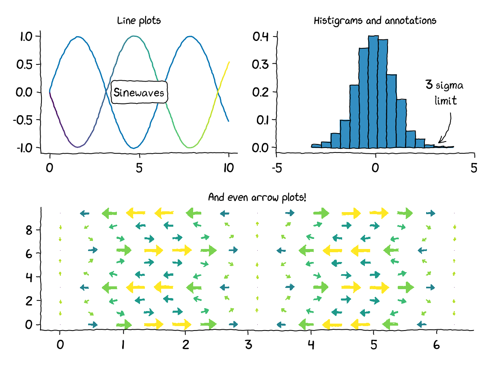
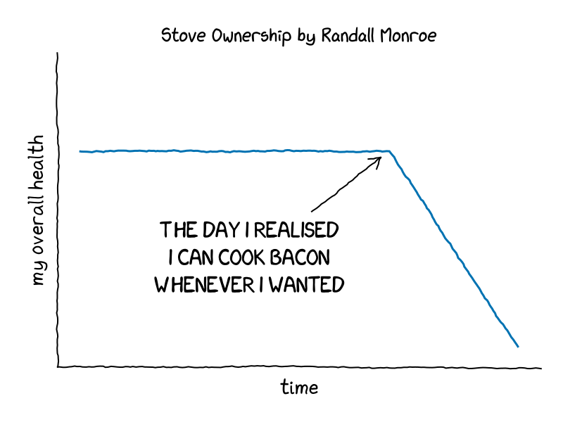
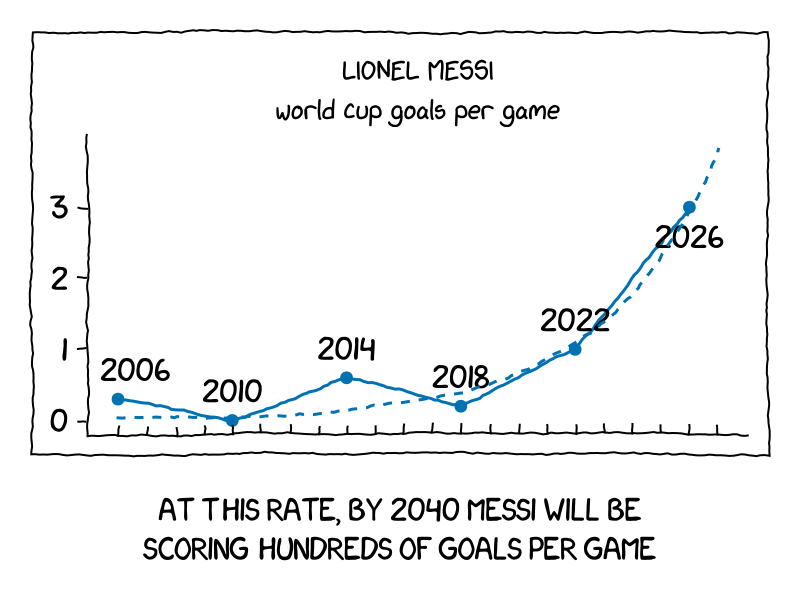
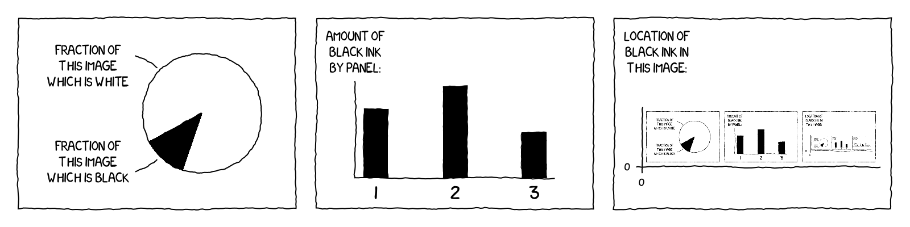

# XKCDMakie.jl

> Finally, a worthy competitor to Matplotlib's `xkcd` mode

The title speaks for itself: an extremely crude hack into [Makie.jl](https://github.com/MakieOrg/Makie.jl) that makes the plots look more hand-drawn. As of now works only with the CairoMakie backend.

Uses the authentic [xkcd font](https://github.com/ipython/xkcd-font/tree/master) ([CC BY-NC 3.0](https://creativecommons.org/licenses/by-nc/3.0/)).

Paste it into your REPL to install:
```julia
using Pkg; Pkg.add("XKCDMakie")
```
or
```
]add XKCDMakie
```

Use it the same way you use `CairoMakie`. After `import`ing the package, the whole XKCD mode behaves like a Makie theme, which you can update or disable by running `Makie.set_theme!`. See `theme_xkcd` for more info.

## Gallery

All images in this gallery were generated using this package. You can find the code in the [`contrib/`](contrib/) directory.



<details>
<summary>Code for this figure</summary>

```julia
using Pkg
Pkg.add(url="https://github.com/aryavorskiy/XKCDMakie.jl")
using XKCDMakie

fig = Figure(size=(600, 500))
Label(fig[0, 1:2], "XKCDMakie.jl demo plot", fontsize=20, font=:bold)

xs = 0:0.1:10
lines(fig[1, 1], xs, sin.(xs), axis=(;title="Line plots"), linestyle=:dash)
lines!(fig[1, 1], xs, -sin.(xs), color=xs)
textlabel!(fig[1, 1], Point2f(5, 0), "Sinewaves")

hist(fig[1, 2], randn(1000), normalization=:pdf,
    axis=(;limits=((-5, 5), (0, nothing)), title="Histograms and annotations"))
n_pdf(x) = 1/sqrt(2pi) * exp(-x^2/2)
annotation!(fig[1, 2], 3.5, n_pdf(0) / 2, 3, n_pdf(3), text="3 sigma\n limit",
    path=Ann.Paths.Arc(-0.4), style=Ann.Styles.LineArrow(), labelspace=:data)

xs = LinRange(0, 2pi, 15)
ys = LinRange(0, 3pi, 10)
us = [sin(x) * cos(y) for x in xs, y in ys]
vs = [-cos(x) * sin(y) for x in xs, y in ys]
strength = vec(sqrt.(us .^ 2 .+ vs .^ 2))
arrow_fun(x) = Point2f(sin(x[1])*cos(x[2]), -cos(x[1])*sin(x[2]))
arrows2d(fig[2, 1:2], xs, ys, arrow_fun, lengthscale=0.3, color=strength,
        axis=(;title="And even arrow plots!"))
fig
```
</details>

**Disclaimer:** these works below belong to Randall Munroe, I only adapted them to XKCDMakie.

| [Stove Ownership](https://xkcd.com/418/) | [Messi](https://xkcd.com/3260/) |
| --- | --- |
|  |  |

| [Self-Description](https://xkcd.com/688/) |
| --- |
|  |
